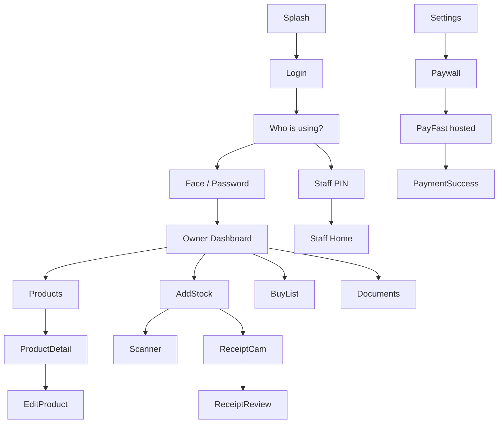

# Smart Inventory OS — Wireframe Specification v1.0

**Status:** Design in progress  
**Aligned with:** Architecture v1.8 · Brand Brief v1.1 · Database Schema v1.0  
**Platform:** Mobile-first (390×844 reference) · Online-first

---

## Design Tokens (from Brand Brief)

| Token | Value |
|-------|-------|
| Primary | `#4F46E5` |
| Accent | `#14B8A6` |
| Background | `#F8FAFC` |
| Card | `#FFFFFF`, radius 16px |
| Text primary | `#0F172A` |
| Text muted | `#64748B` |
| Min tap target | 48×48px |
| Min body text | 16px |
| Hero numbers | 36–40px bold |

---

## Global Patterns

### Header (Owner / Staff)
```
┌─────────────────────────────────────┐
│ [Mark 32px] Smart Inventory OS   🔔│
│             {Shop Name}             │
└─────────────────────────────────────┘
```

### Bottom Nav — Owner
`Home` · `Products` · `Buy List` · `Documents`

### Bottom Nav — Staff
`Scan` · `Products` · `Switch User`

### Session Rule
After 15 min idle → Screen 4 (Who is using the app?)

---

## Copy Deck (EN / AF / XH)

| Key | EN | AF | XH |
|-----|----|----|-----|
| app_name | Smart Inventory OS | Smart Inventory OS | Smart Inventory OS |
| tagline | Your shop, smarter. | Jou winkel, slimmer. | Ivenkile yakho, ihlakaniphe. |
| sign_in | Sign in | Teken in | Ngena |
| sign_up | Create account | Skep rekening | Yenza i-akhawunti |
| who_using | Who is using the app? | Wie gebruik die app? | Ngubani usebenzisa i-app? |
| owner | Owner | Eienaar | Umnini |
| staff | Staff | Personeel | Abasebenzi |
| enter_pin | Enter your PIN | Voer PIN in | Faka i-PIN yakho |
| stock_value | Stock Value | Voorraadwaarde | Ixabiso lempahla |
| products | Products | Produkte | Iimveliso |
| low_stock | Low Stock | Lae voorraad | Impahla ephantsi |
| buy_list | Buy List | Kooplys | Uluhlu lokuthenga |
| today_purchases | Today's Purchases | Vandag se aankope | Uninzi lwanamhlanje |
| add_stock | Add Stock | Voeg voorraad by | Yongeza impahla |
| photo_receipt | Photo of receipt | Foto van kwitansie | Ifoto yerisithi |
| scan_barcode | Scan barcode | Skandeer strepie | Skena ibhakhodi |
| sold | Sold | Verkoop | Ithengisiwe |
| received | Received | Ontvang | Ifunyenwe |
| cash | Cash | Kontant | Imali |
| card | Card | Kaart | Ikhadi |
| upgrade_price | R79.99 / month | R79.99 / maand | R79.99 / inyanga |
| cancel_pro | Cancel Pro | Kanselleer Pro | Rhoxisa i-Pro |
| keep_pro | Keep Pro | Behou Pro | Gcina i-Pro |
| documents | Documents | Dokumente | Amaxwebhu |
| settings | Settings | Instellings | Iisetingi |
| switch_user | Switch user | Wissel gebruiker | Tshintsha umsebenzisi |

---

## Screen 1 — Splash

**Purpose:** Brand moment on app open  
**Duration:** 1.5s max → Screen 3 or 4 if session valid

```
┌─────────────────────────────────────┐
│                                     │
│                                     │
│           [Mark 96px]               │
│       Smart Inventory OS            │
│       Your shop, smarter.           │
│                                     │
│                                     │
└─────────────────────────────────────┘
```

| Element | Behaviour |
|---------|-----------|
| Logo | Scale 0.92→1, fade in |
| Auto-nav | Valid session → Dashboard; else → Login |

**Why:** First impression of premium product.

---

## Screen 2 — Sign Up (Owner only)

**Purpose:** Create shop + owner account  
**Time target:** Under 2 minutes

```
┌─────────────────────────────────────┐
│           [Mark 64px]               │
│       Smart Inventory OS            │
│                                     │
│  Shop name                          │
│  ┌─────────────────────────────┐   │
│  │ Thabo's Spaza               │   │
│  └─────────────────────────────┘   │
│  Phone number                       │
│  ┌─────────────────────────────┐   │
│  │ 082 123 4567                │   │
│  └─────────────────────────────┘   │
│  Email                              │
│  ┌─────────────────────────────┐   │
│  │ thabo@email.com             │   │
│  └─────────────────────────────┘   │
│  Password                           │
│  ┌─────────────────────────────┐   │
│  │ ••••••••                    │   │
│  └─────────────────────────────┘   │
│                                     │
│  ┌─────────────────────────────┐   │
│  │      Create account         │   │  ← gradient primary
│  └─────────────────────────────┘   │
│                                     │
│  Already have account? Sign in      │
│                                     │
│  EN  |  AF  |  XH                   │
└─────────────────────────────────────┘
```

**Post-submit flow:**
1. → Optional: "Use face to open app next time?" [Yes] [Not now]
2. → Optional: "Add shop papers" [Skip] [Add]
3. → Screen 4 (Who is using — owner only at first)

**Why each field:** Shop name on header; phone + email for login/recovery; password for account security.

---

## Screen 3 — Login (Owner)

**Purpose:** Returning owner access

```
┌─────────────────────────────────────┐
│           [Mark 64px]               │
│       Smart Inventory OS            │
│       Your shop, smarter.           │
│                                     │
│  ┌─────────────────────────────┐   │
│  │   👤  Use face               │   │  ← if biometric enrolled
│  └─────────────────────────────┘   │
│                                     │
│  Phone or email                     │
│  ┌─────────────────────────────┐   │
│  └─────────────────────────────┘   │
│  Password                           │
│  ┌─────────────────────────────┐   │
│  └─────────────────────────────┘   │
│                                     │
│  ┌─────────────────────────────┐   │
│  │        Sign in              │   │
│  └─────────────────────────────┘   │
│                                     │
│  Forgot password?                   │
│  Create account                     │
│  EN  |  AF  |  XH                   │
└─────────────────────────────────────┘
```

**Success:** → Screen 4 (user picker)

**Why face button first:** Fastest path for daily owner use.

---

## Screen 4 — Who Is Using the App?

**Purpose:** Shared phone — identify actor before actions  
**Shows:** Every new session + after 15 min idle

```
┌─────────────────────────────────────┐
│       [Mark] Smart Inventory OS     │
│                                     │
│     Who is using the app?           │
│                                     │
│   ┌───────────┐   ┌───────────┐    │
│   │  [photo]  │   │  [photo]  │    │
│   │   Thabo   │   │   Nomsa   │    │
│   │   Owner   │   │   Staff   │    │
│   └───────────┘   └───────────┘    │
│                                     │
│   ┌───────────┐                     │
│   │    +      │                     │  ← owner only (if logged in as owner context)
│   │ Add staff │                     │
│   └───────────┘                     │
└─────────────────────────────────────┘
```

| Tap | Next |
|-----|------|
| Owner | Screen 3 subset (face/password) OR direct if session |
| Staff | Screen 5 (PIN) |
| Add staff | Screen 19 → Add staff (owner auth required) |

**Why:** Audit trail + correct permissions on shared device.

---

## Screen 5 — Staff PIN Pad

**Purpose:** Fast staff login without email

```
┌─────────────────────────────────────┐
│              ← Back                 │
│                                     │
│         Hi, Nomsa                   │
│         Enter your PIN              │
│                                     │
│            • • • •                  │
│                                     │
│      ┌───┐ ┌───┐ ┌───┐             │
│      │ 1 │ │ 2 │ │ 3 │             │
│      └───┘ └───┘ └───┘             │
│      ┌───┐ ┌───┐ ┌───┐             │
│      │ 4 │ │ 5 │ │ 6 │             │
│      └───┘ └───┘ └───┘             │
│      ┌───┐ ┌───┐ ┌───┐             │
│      │ 7 │ │ 8 │ │ 9 │             │
│      └───┘ └───┘ └───┘             │
│            ┌───┐                   │
│            │ 0 │                   │
│            └───┘                   │
└─────────────────────────────────────┘
```

| State | Message |
|-------|---------|
| 5 fails | Locked 5 min · Owner notified |
| Success | → Screen 7 (Staff home) |

**Why 4-digit PIN:** Familiar as ATM/card PIN; large keys for counter use.

---

## Screen 6 — Owner Dashboard (Home)

**Purpose:** 10-second shop pulse — 5 widgets only, no graphs  
**Plan badge:** `PRO` pill or `Free` subtle label

```
┌─────────────────────────────────────┐
│ [Mark] Smart Inventory OS      🔔  │
│        Thabo's Spaza                │
├─────────────────────────────────────┤
│  Good afternoon, Thabo              │
│                                     │
│  ┌─────────────────────────────┐   │
│  │  STOCK VALUE                 │   │
│  │  R 24,580                    │   │  ← hero card
│  │  known items only            │   │
│  └─────────────────────────────┘   │
│  ┌──────────────┐ ┌──────────────┐ │
│  │ PRODUCTS     │ │ LOW STOCK    │ │
│  │ 127          │ │ 8            │ │
│  │ (28/30 Free) │ │              │ │
│  └──────────────┘ └──────────────┘ │
│  ┌─────────────────────────────┐   │
│  │  BUY LIST                    │   │
│  │  • White bread — buy 20     │   │  Pro
│  │  • Coke 2L — buy 12         │   │
│  │  See full list →             │   │
│  └─────────────────────────────┘   │
│  ┌─────────────────────────────┐   │
│  │  TODAY'S PURCHASES           │   │
│  │  14 items · R 2,340 cost     │   │
│  └─────────────────────────────┘   │
│  ┌─────────────────────────────┐   │
│  │  📷  ADD STOCK               │   │  ← gradient CTA
│  │  Photo receipt or scan       │   │
│  └─────────────────────────────┘   │
├─────────────────────────────────────┤
│  Home   Products   Buy   Documents  │
└─────────────────────────────────────┘
```

| Widget tap | Goes to |
|------------|---------|
| Stock value | Screen 8 |
| Products | Screen 8 |
| Low stock | Screen 15 |
| Buy list | Screen 15 |
| Today's purchases | Screen 13 drill-down |
| Add stock | Screen 11 |

**Free tier differences:**
- Buy list shows names only + "Upgrade for amounts"
- Products shows `28/30`
- Optional banner: weekly manual overdue

**Empty state (new shop):**
```
No products yet
Scan or photo your first stock
[ Add Stock ]
```

**Why each widget:** Approved v1.8 — nothing else on home.

---

## Screen 7 — Staff Home

**Purpose:** Counter-fast actions — no money, no docs, no billing

```
┌─────────────────────────────────────┐
│ [Mark]  Hi, Nomsa                    │
├─────────────────────────────────────┤
│  ┌─────────────────────────────┐   │
│  │  SCAN SOLD                   │   │  ← largest
│  │  Scan or tap product sold    │   │
│  └─────────────────────────────┘   │
│  ┌─────────────────────────────┐   │
│  │  ADD STOCK (scan in)         │   │
│  └─────────────────────────────┘   │
│  ┌──────────────┐ ┌──────────────┐ │
│  │ TODAY SOLD   │ │ LOW STOCK    │ │
│  │ 47 items     │ │ 8            │ │
│  └──────────────┘ └──────────────┘ │
├─────────────────────────────────────┤
│  Scan   Products   Switch User      │
└─────────────────────────────────────┘
```

| Hidden from staff | Reason |
|-------------------|--------|
| Stock value R | Sensitive |
| Buy list quantities | Owner decision |
| Documents / Settings / Pro | Owner only |

**Why:** 2-tap sell path while serving customers.

---

## Screen 8 — Products List

**Purpose:** All products — name, qty, cost, sell price

```
┌─────────────────────────────────────┐
│  ← Home          Products      🔍   │
├─────────────────────────────────────┤
│  Search products...                 │
│                                     │
│  ┌─────────────────────────────┐   │
│  │ White bread                  │   │
│  │ Qty 24 · Cost R10 · Sell R14│   │
│  └─────────────────────────────┘   │
│  ┌─────────────────────────────┐   │
│  │ Coke 2L                      │   │
│  │ Qty 8 · Cost R18 · Sell R25 │   │
│  └─────────────────────────────┘   │
│  ┌─────────────────────────────┐   │
│  │ Loose sweets          WEEKLY│   │  ← badge
│  │ Qty ~2 packs · manual       │   │
│  └─────────────────────────────┘   │
│                                     │
│              [ + ]                  │  ← owner: add via scan
└─────────────────────────────────────┘
```

| User | + button |
|------|----------|
| Owner | → Screen 11 or 14 |
| Staff | Hidden or → scan only |

**Free limit banner:** `28 of 30 products · Upgrade for unlimited`

**Why:** Feature #3 — ledger made visible.

---

## Screen 9 — Product Detail

**Purpose:** One product history + actions

```
┌─────────────────────────────────────┐
│  ← Products                         │
│                                     │
│  White bread                        │
│  Qty 24                             │
│  Cost R10 · Sell R14                │
│                                     │
│  ┌────────┐ ┌────────┐ ┌────────┐   │
│  │Stock In│ │  Sold  │ │  Edit  │   │  ← Sold hidden for manual weekly
│  └────────┘ └────────┘ └────────┘   │
│                                     │
│  Movement                           │
│  ─────────────────────────────     │
│  Received +24 · Thabo · 9:00       │
│  Sold −2 · Nomsa · 2:34 PM          │
│  Sold −1 · Nomsa · 4:10 PM          │
│                                     │
└─────────────────────────────────────┘
```

**Why:** Feature #7 without separate reports screen.

---

## Screen 10 — Edit Product (Owner)

**Purpose:** Fix name/prices/type — not quantity directly

```
┌─────────────────────────────────────┐
│  ← Cancel              Save         │
│                                     │
│  Name                               │
│  [ White bread                    ] │
│  Cost price                         │
│  [ R 10.00                        ] │
│  Sell price                         │
│  [ R 14.00                        ] │
│                                     │
│  Type                               │
│  ( ) Packaged  ( ) Manual weekly    │
│                                     │
│  If manual:                         │
│  ( ) Full pack  ( ) Weekly estimate │
│  Track inventory [ ON / OFF ]       │
│                                     │
└─────────────────────────────────────┘
```

**Why qty not editable:** Forces ledger events — prevents silent errors.

---

## Screen 11 — Add Stock Hub (Owner)

```
┌─────────────────────────────────────┐
│  ← Back                             │
│                                     │
│  Add Stock                          │
│                                     │
│  ┌─────────────────────────────┐   │
│  │  📄  Photo of receipt        │   │  ← Pro OCR / Free → paywall
│  └─────────────────────────────┘   │
│  ┌─────────────────────────────┐   │
│  │  📷  Scan barcode (IN)       │   │
│  └─────────────────────────────┘   │
│  ┌─────────────────────────────┐   │
│  │  ✏️  Enter manually          │   │  ← Free fallback
│  └─────────────────────────────┘   │
│                                     │
└─────────────────────────────────────┘
```

---

## Screen 12 — Receipt Camera (Owner)

```
┌─────────────────────────────────────┐
│  ✕                                  │
│                                     │
│     ┌─────────────────────┐        │
│     │   viewfinder        │        │
│     │   Lay receipt flat  │        │
│     └─────────────────────┘        │
│                                     │
│            ( ◉ )                    │  ← shutter
│                                     │
└─────────────────────────────────────┘
```

**Pro:** → OCR processing → Screen 12b  
**Free tap:** → Paywall (Screen P1)

---

## Screen 12b — Receipt Review (Owner)

```
┌─────────────────────────────────────┐
│  ← Back              Confirm        │
│  [receipt thumbnail]                │
│                                     │
│  Product      Qty   Cost    ✓      │
│  ─────────────────────────────     │
│  White bread   24   R10     ✓      │
│  Coke 2L       12   R18     ✓      │
│  [ + Add line ]                     │
│                                     │
│  ┌─────────────────────────────┐   │
│  │  Confirm — Add to Stock      │   │
│  └─────────────────────────────┘   │
└─────────────────────────────────────┘
```

**Why confirm step:** AI suggests — owner always approves.

---

## Screen 13 — Barcode Scanner

**Purpose:** Scan IN or OUT (packaged goods)

```
┌─────────────────────────────────────┐
│  ✕                    IN | OUT      │  ← toggle
│                                     │
│     ┌─────────────────────┐        │
│     │   camera + reticle   │        │
│     └─────────────────────┘        │
│                                     │
│  Last: +1 White bread ✓             │
│                                     │
│  [ Enter barcode manually ]         │
└─────────────────────────────────────┘
```

| Scan result | Action |
|-------------|--------|
| Known + IN | +1 (qty keypad optional) |
| Known + OUT | −1 sold |
| Unknown | → Screen 14 |

**Why toggle:** One scanner — two ledger events.

---

## Screen 14 — Quick Add Product

```
┌─────────────────────────────────────┐
│  New product                        │
│                                     │
│  Barcode [ 6001234567890 ]          │
│  Name    [ _______________ ]        │
│  Cost    [ R ____________ ]         │
│  Sell    [ R ____________ ]         │
│                                     │
│  Type: (•) Packaged  ( ) Manual      │
│                                     │
│  [ Save & add stock ]               │
└─────────────────────────────────────┘
```

---

## Screen 15 — Shopping List (Buy List)

**Purpose:** Smart recommendations — Pro full / Free teaser

```
┌─────────────────────────────────────┐
│  Buy List                           │
│                                     │
│  BUY THIS (Pro)                     │
│  ┌─────────────────────────────┐   │
│  │ White bread · buy 20         │   │
│  │ Sells ~7/day · 2 left        │   │
│  └─────────────────────────────┘   │
│  ┌─────────────────────────────┐   │
│  │ Coke 2L · buy 12             │   │
│  │ Fast mover · 3 left          │   │
│  └─────────────────────────────┘   │
│                                     │
│  REMEMBER                           │
│  ┌─────────────────────────────┐   │
│  │ Loose sweets · update weekly │   │
│  └─────────────────────────────┘   │
│                                     │
└─────────────────────────────────────┘
```

**Free:** Names only + tap → Paywall P1

---

## Screen 16 — Daily Stock Check (Pro / Owner)

```
┌─────────────────────────────────────┐
│  Daily Stock Check                  │
│  Count these 5 today                  │
│                                     │
│  1 of 5                             │
│  White bread                        │
│  Expected: 24                       │
│                                     │
│  How many did you count?            │
│  ┌─────────────────────────────┐   │
│  │         22                   │   │
│  └─────────────────────────────┘   │
│  [ 1 ] [ 2 ] [ 3 ] ... [ C ] [ ✓ ]  │
│                                     │
│  Reason if different (optional)     │
└─────────────────────────────────────┘
```

**Free tap:** → Paywall P1

---

## Screen 17 — Weekly Manual Stock (Owner)

```
┌─────────────────────────────────────┐
│  Weekly Update                      │
│                                     │
│  Loose sweets                       │
│  Full packs left?                   │
│  ┌─────────────────────────────┐   │
│  │  2                           │   │
│  └─────────────────────────────┘   │
│                                     │
│  OR packs used this week?           │
│  ┌─────────────────────────────┐   │
│  │  3                           │   │
│  └─────────────────────────────┘   │
│                                     │
│  [ Save ]                           │
└─────────────────────────────────────┘
```

---

## Screen 18 — Documents (Owner)

```
┌─────────────────────────────────────┐
│  Documents                          │
│  All | Receipts | Shop | Other      │
│                                     │
│  ┌────┐ Receipt · 5 Jul             │
│  │thumb│ Makro delivery              │
│  └────┘                             │
│  ┌────┐ Shop paper · ID              │
│  │thumb│                             │
│  └────┘                             │
│                                     │
│  [ + Add document ]                 │
│                                     │
│  Free: 4 of 5 used                  │
└─────────────────────────────────────┘
```

---

## Screen 19 — Settings (Owner)

```
┌─────────────────────────────────────┐
│  Settings                           │
│                                     │
│  Plan: Pro until 12 Apr             │
│  ┌─────────────────────────────┐   │
│  │  R79.99 / month              │   │  ← upgrade if Free
│  └─────────────────────────────┘   │
│  [ Cancel Pro ]                     │
│                                     │
│  Staff                              │
│  • Nomsa  [ Reset PIN ]             │
│  [ + Add staff ]                    │
│  Staff can adjust stock [ ON ]      │
│                                     │
│  Security                           │
│  Use face to open app [ ON ]        │
│  Verify face for sensitive [ ON ]   │
│                                     │
│  Email                              │
│  Weekly summary [ ON ] Pro          │
│                                     │
│  Language: EN | AF | XH             │
│  Sign out                           │
└─────────────────────────────────────┘
```

---

## Screen P1 — Paywall

```
┌─────────────────────────────────────┐
│  [Mark]                             │
│  Smart Inventory Pro                │
│                                     │
│  ✓ Photo reads receipt              │
│  ✓ How much to buy + why            │
│  ✓ Daily count list                 │
│                                     │
│  ┌─────────────────────────────┐   │
│  │  R79.99 / month              │   │  ← TAP = PayFast link
│  └─────────────────────────────┘   │
│                                     │
│  Recurring · Cancel anytime         │
│  Secure payment via PayFast         │
│                                     │
│  [ Enter manually instead ]         │
└─────────────────────────────────────┘
```

---

## Screen P2 — Payment Success

```
┌─────────────────────────────────────┐
│            ✓                        │
│  Payment received                   │
│  Pro is active                      │
│                                     │
│  [ Take a receipt photo now ]       │
└─────────────────────────────────────┘
```

---

## Screen P3 — Cancel Pro (with face verify)

```
┌─────────────────────────────────────┐
│  Cancel Pro?                        │
│  Pro until 12 Apr · then Free       │
│  You won't be charged again.        │
│                                     │
│  [ Keep Pro ]  [ Yes, cancel ]      │
└─────────────────────────────────────┘
        → Face verify → PayFast cancel API
```

---

## Navigation Map



---

## Interaction Targets (Accessibility)

| Element | Min height |
|---------|------------|
| Primary CTA | 56px |
| Product row | 72px |
| PIN key | 64px |
| Bottom nav item | 48px |

---

## Next Design Deliverables

- [ ] High-fidelity mockups (Figma) using brand tokens
- [ ] API contract (Step B)
- [ ] Implementation (when approved)

---

*Wireframes v1.0 — Smart Inventory OS*
